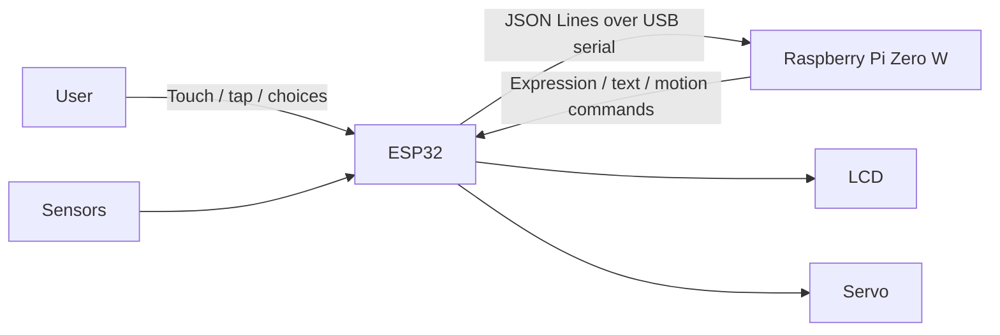

# DeskCat

DeskCat は、机上で静かに振る舞う猫型ペットロボットです。ESP32 が表示・センサ・サーボなどの実時間 I/O を担当し、Raspberry Pi Zero W が感情、状態、自律行動、ログ、設定を担当します。

> 開発状態: 基盤整備とハードウェア特定
> 正確なmodule、GPIO割当て、電力budget、サーボ制限が確定するまで、hardware driverの実装は開始しない。

[公開ドキュメント](https://wachi-yoshitaka-11-dev.github.io/deskcat/)は、repository内の正本からGitHub Pagesへ生成する。
[Wiki](https://github.com/wachi-yoshitaka-11-dev/deskcat/wiki)は、公開文書への案内専用とする。

## 初期MVP

- LCD にコード描画した猫の表情を表示する
- 頭を撫でると喜ぶ
- 軽く叩くと驚く
- 首を安全な範囲で動かす
- アイドル時に短い独り言を表示する
- Raspberry Pi と ESP32 が USB シリアルで状態と命令を交換する

カメラ、マイク、音声出力、画像アセット中心の表情、ネットワーク OTA は初期 MVP に含めません。

## アーキテクチャ



| 層 | 責務 |
|---|---|
| ESP-WROOM-32D開発ボード（秋月電子 M-13628） | LCD、touch、加速度、環境sensor、サーボ、即時安全制御 |
| Raspberry Pi Zero W（V1.1） | 感情、行動、独り言、log、設定、API |
| Protocol | 初期USB serial link上の、version付き・最大長制限付きJSON Lines |

Piから不正なcommandを受け取った場合も、ESP32が物理安全制限を強制する。

## Repository構成

```text
.github/                   workflow、Issue／PR template、repository設定の記録
apps/deskcatd/             Raspberry Pi service
crates/                    host側Rust library
firmware/esp32/            独立したESP-IDF Rust workspace
simulator/deskcat-sim/     host simulator
configs/                   秘密情報を含まない設定例
deploy/                    Raspberry Pi deployment artifact
docs/architecture/         アーキテクチャ（予定文書の一覧）
docs/backlog/              初期Issue定義
docs/decisions/            ADR
docs/governance/           AI、workflow、安全方針
docs/hardware/             ハードウェア情報の正式な定義元
docs/planning/             複数Issueにまたがる開発計画
docs/protocol/             wire protocolの正式な定義元
docs/runbooks/             再現可能な手順
docs/toolchains/           端末roleとtoolchainの正式な定義元
hardware/                  version管理する回路図・CAD source
pages/                     GitHub Pages固有の入口、設定、404
tests/hil/                 Hardware-in-the-Loop test
scripts/                   再現可能な開発補助script
```

workspaceの判断は[ADR-0001](docs/decisions/0001-monorepo-layout.md)を参照する。

## 最初に読むもの

1. [AGENTS.md](AGENTS.md)を読む。
2. [Governance一覧](docs/governance/README.md)を読む。
3. [開発計画](docs/planning/development-foundation-plan.md)を確認する。
4. [ハードウェアTBD一覧](docs/hardware/tbd-register.md)を確認する。
5. 組込み設計とbring-upには[マイコン開発技術ガイド](docs/DeskCat_Microcontroller_Development_Guide.md)を使う。
6. [ESP32–Pi protocol draft](docs/protocol/esp32-pi-protocol.md)を読む。
7. 現在の端末の[開発profile](docs/toolchains/machine-profiles.md)を選ぶ。

## 現在のblocker

**未確定の物理情報は[TBD一覧](docs/hardware/tbd-register.md)が正本である。**この節では列挙しない。複製すると、解決済みの項目が未確定として残り続ける（[Single Source of Truth](docs/governance/README.md#single-source-of-truth)）。

確定した部品識別情報は[Hardware BOM](docs/hardware/hardware-bom.md)にある。**例の候補値をfirmwareへ転記しない。**

## Buildとtest

文書作成・review専用端末にはRust、ESP-IDF、USB toolを導入しない。[ESP32セットアップrunbook](docs/runbooks/esp32-development-machine-setup.md)または[Raspberry Piセットアップrunbook](docs/runbooks/raspberry-pi-development-machine-setup.md)は、対応profileを割り当てた端末だけで使用し、[version記録template](docs/toolchains/version-record-template.md)で環境を記録する。

### 検証済みcommand

**コマンドと来歴の正本は[検証済みコマンド](docs/toolchains/verified-commands.md)である。**
host workspace、ESP32 firmware、Raspberry Pi の実行手順と、それぞれが何を主張し何を主張しないかを持つ。
**この README へコマンドを写さない**（[ADR-0018](docs/decisions/0018-instruction-file-structure.md)）。

**以前はこの節が command と来歴を重複して持っており、実際に古くなっていた。**
2026-09-09 の時点で、ESP32 の「現行 tree に対する最新の検証」を 2026-08-10 と書いていたが、
2026-08-15 の[Version Record](docs/toolchains/version-records/2026-08-15-esp32-build-native-linux.md)が存在していた。
「未確定の command」として ESP32 の flash・serial monitor と Raspberry Pi の build を挙げていたが、
どちらも[2026-08-20](docs/toolchains/version-records/2026-08-20-esp32-flash-boot-native.md)と
[2026-08-26](docs/toolchains/version-records/2026-08-17-pi-direct-build-native.md)に検証済みだった。

ESP32 の toolchain 確定版（target、channel、ESP-IDF、linker）は
[ESP32 Rust Toolchain](docs/toolchains/esp32-rust-toolchain.md)が正本である。

**まだ検証済み command が無いのは、Raspberry Pi の実機試験（実 serial port、ESP32 との通信）と HIL である。**
[検証済みコマンド](docs/toolchains/verified-commands.md)の「まだコマンドが無いもの」が正本であり、
**この README では列挙しない。**複製すると、解決済みの項目が未確定として残り続ける（上と同じ失敗）。

## 参考資料と生成data

- 一時的に提供された PDF や参考資料は、再配布可能と確認できない限り Git へ追加しない。
- 必要な事実は、出典と確認状態を付けてリポジトリ固有の文書へ転記する。
- 確認後に不要となったローカル参考資料は、ユーザーの指示または合意した手順に従って削除する。
- 画像、波形、計測 capture、生成物を永続化する場合は、Issue で出所、ライセンス、容量、保存場所を決める。
- 通常の Git review に適さない大きな versioned binary が必要になった場合だけ、Git LFS または外部 artifact storage を検討する。

## ハードウェア安全

- サーボをESP32のGPIO、3.3 V rail、board regulatorから給電しない。
- 適切に容量設計した別サーボ電源を使用し、GNDを意図的に共通化する。
- logic電圧が未確認の信号を接続しない。
- 正確なPWM条件と機械制限が確定するまでサーボ出力を無効にする。
- 初回通電と初回サーボ動作では、人間が直ちに電源を切れる状態にする。

配線や動作testの前に、必須の[ハードウェア安全方針](docs/governance/hardware-safety-policy.md)を読む。

## Contribution方法

[CONTRIBUTING.md](CONTRIBUTING.md)を参照する。一つのIssueには一つの主目的を設定し、測定可能な受け入れ条件と、必要なハードウェア証拠を記載する。

security上機微な報告はpublic Issueへ書かず、[SECURITY.md](SECURITY.md)に従う。

## ライセンス

DeskCatは[MIT License](LICENSE)で提供する。
